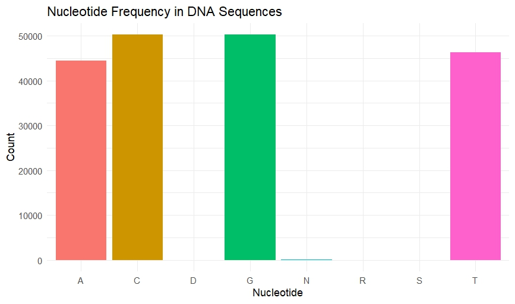

# 🧬 Predicting Splice Junctions in DNA Sequences Using Machine Learning

> **“Classifying exon-intron boundaries through intelligent sequence decoding – merging genomics with machine learning.”**

---

## 🚀 Project Overview
This project explores a machine learning-driven approach to **classify DNA sequences into splice site types** – a critical problem in bioinformatics. The classification includes:
- **EI (Exon-Intron junction)**
- **IE (Intron-Exon junction)**
- **N (Non-Splice sites)**

We apply **Python and R-based modeling**, robust **feature engineering**, and **biological pattern visualizations** to enhance gene annotation accuracy.

---

## 🧠 Problem Statement
Splice junction detection is pivotal for gene expression and protein synthesis analysis. Traditional motif-based methods lack flexibility for diverse biological sequences. Our challenge was to:
- Handle **high-dimensional DNA data**
- Extract meaningful nucleotide patterns
- Apply ML models to learn splice site features automatically

---

## 🎥 Project Pitch Video
[](https://www.youtube.com/watch?v=sGUtIR6pUaU)

---

## 📊 Dataset Summary
| Feature | Description |
|--------|-------------|
| Source | UCI Machine Learning Repository |
| Records | 3,175 sequences |
| Length | 60 nucleotides per sequence |
| Classes | EI, IE, N |

---

## 🧪 Tools & Technologies
| Language | Tools/Frameworks |
|---------|------------------|
| Python | pandas, numpy, scikit-learn, tensorflow |
| R | ggplot2, tidyverse, ggpubr, ggridges, ggseqlogo, ggalluvial |

---

## 🧩 Methodology & Workflow
1. **Data Preprocessing**
   - One-hot encoding
   - k-mer frequency extraction
2. **Exploratory Data Analysis (EDA)** using R:
   - Nucleotide frequency plots
   - GC content distribution
   - Top 2-mers and 3-mers
   - Splice site motif visualization
   - Sankey plots for nucleotide transitions
3. **Model Implementation**
   - Logistic Regression
   - Random Forest
   - Optimized Random Forest (GridSearchCV)
   - Deep Neural Networks (TensorFlow)
4. **Performance Evaluation**
   - Accuracy, Precision, Recall, F1-score
   - Confusion Matrices & Feature Importance plots

---

## 📈 Model Evaluation Summary
| Model | Accuracy | Precision | Recall | F1-score |
|-------|---------|-----------|--------|----------|
| Logistic Regression | 94.04% | 94.15% | 94.04% | 94.07% |
| Random Forest | 96.55% | 96.61% | 96.55% | 96.56% |
| Optimized RF | 96.55% | 96.63% | 96.55% | 96.57% |
| Deep Neural Network | 94.67% | 94.79% | 94.67% | 94.71% |

---

## 🖼 Visual Plots and Insights

### 🔬 R-Based EDA Visualizations:

**Nucleotide Frequency Distribution**  
Shows the frequency of A, T, C, G across DNA sequences — important to understand composition biases.  


**GC Content Density Plot**  
Demonstrates variation in GC content across different classes, offering insight into sequence stability.  


**Top 2-mers and 3-mers**  
Highlights commonly occurring nucleotide patterns (di-nucleotides and tri-nucleotides) for feature selection.  


**Sequence Length Distribution**  
Validates uniform sequence lengths, critical for consistent preprocessing.  


**Splice Site Start and End Motifs**  
Visualizes conserved sequence motifs at splice junction boundaries.  


**Nucleotide Transition Sankey Plot**  
Shows nucleotide flow transitions — useful for analyzing positional sequence behavior.  


### 📊 Python-Based Model Performance Visuals:

**Confusion Matrix – Random Forest Model**  
Displays classification results and misclassification patterns for EI, IE, N classes.  


**Model Accuracy Comparison**  
Side-by-side accuracy of Logistic Regression, Random Forest, Optimized RF, and DNN models.  


**Feature Importance Plot – Random Forest**  
Highlights most influential nucleotide positions contributing to classification.  


---

## 📂 Repository Structure
```
dna-splice-junction-classification-gene-sequences/
├── MiniProject_Group15.pptx              → Presentation slides
├── README.md                             → Project documentation
├── Team15_Proposal_DSEM_MiniProject.pdf  → Project proposal
├── Team_15_DSEM_Mini_Project.ipynb       → Python modeling & training
├── Team_15_Project_Report.pdf            → Final report
├── YouTube Video Link.txt                → 1-min video pitch (YouTube link)
├── dna_data.csv                          → Sample DNA dataset
├── plots.R                               → EDA visualizations in R
├── assets/                               → R plots and model performance images
```

---

## 🛠 How to Run the Code
### Python Setup:
```bash
pip install -r requirements.txt
jupyter notebook Team_15_DSEM_Mini_Project.ipynb
```
### R Setup:
Open and run `plots.R` in your R environment to generate all DNA visualizations.

---

## 🌟 Key Contributions
✔ Developed a robust ML classification pipeline for DNA splice site detection  
✔ Achieved over 96% accuracy with optimized Random Forest  
✔ Visualized biological patterns via custom-built R plots  
✔ Delivered full documentation, reporting, and a one-minute project pitch video

---

## 📎 Deliverables Summary
- 🧠 Python ML Workflow (Jupyter Notebook)
- 📊 EDA & Visualization Script (R Script)
- 🖼 Visual Insights (R & Python Plots)
- 📄 Final Report PDF
- 📽 Slide Deck (PPTX)
- 📃 Project Proposal
- 🔗 YouTube Presentation Video

---

## 🔍 Insights & Learnings
- GC content and positional features were most influential
- RF and DNN models outperformed traditional ML
- Strong synergy of bioinformatics + ML offers future research scope

---

## 📌 Note
This repository is intended solely for **academic, research, and portfolio purposes**. All project materials—code, datasets, analysis, visualizations, reports, and documentation—were created as part of the **Data Science Engineering Methods & Tools course at Northeastern University**.

The dataset used in this project is sourced from the **UCI Machine Learning Repository** and is used here in accordance with their guidelines for **non-commercial and educational use only**. Proper attribution has been provided in the README and associated documentation.

> **All rights for the dataset remain with the original creators. This project does not claim ownership of the dataset and is shared purely for learning and demonstration.**

If you intend to reuse or adapt this project or dataset, please review the relevant licensing and attribution requirements for your intended use.

---

## 📬 To reach out to me
**Raghavendra Prasath Sridhar**  
📧 Email: sridhar.r@northeastern.edu  
🔗 LinkedIn: [linkedin.com/in/raghavendraprasath/](https://www.linkedin.com/in/raghavendraprasath/)  
🐙 GitHub: [github.com/raghavendraprasath](https://github.com/raghavendraprasath)

---

> ⭐ *If you found this project interesting, consider giving it a star and following the repository!*
